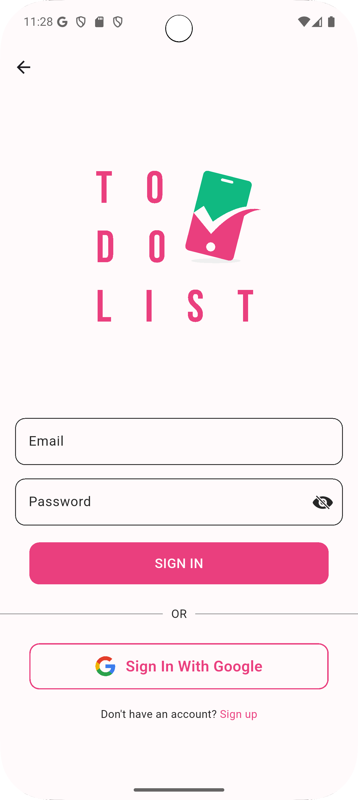
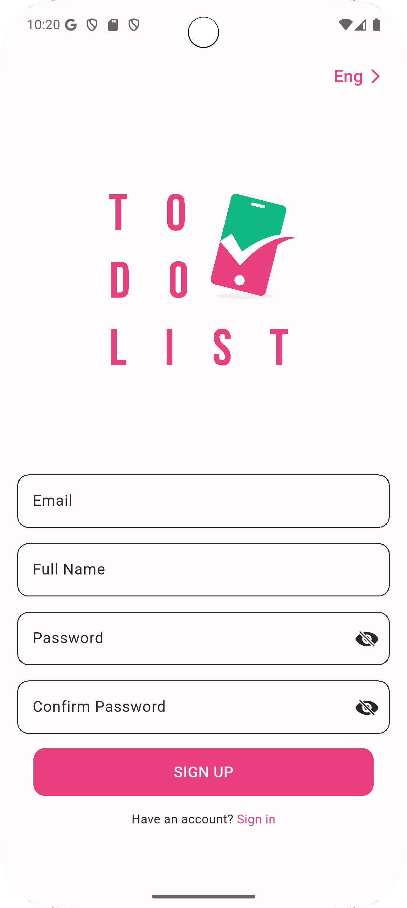
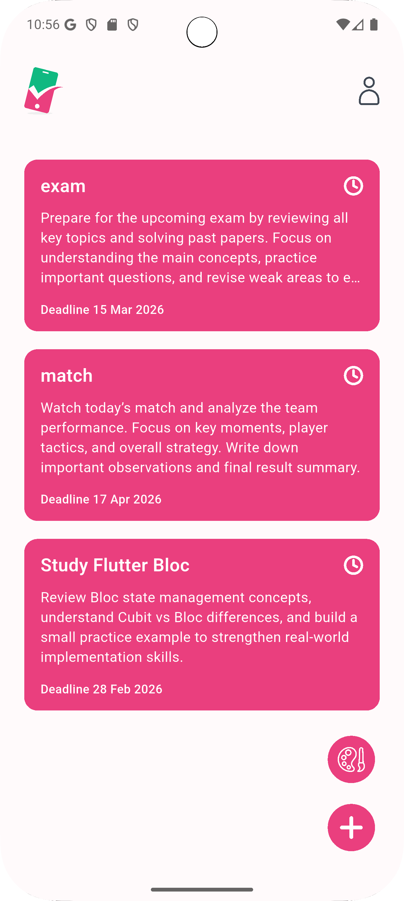
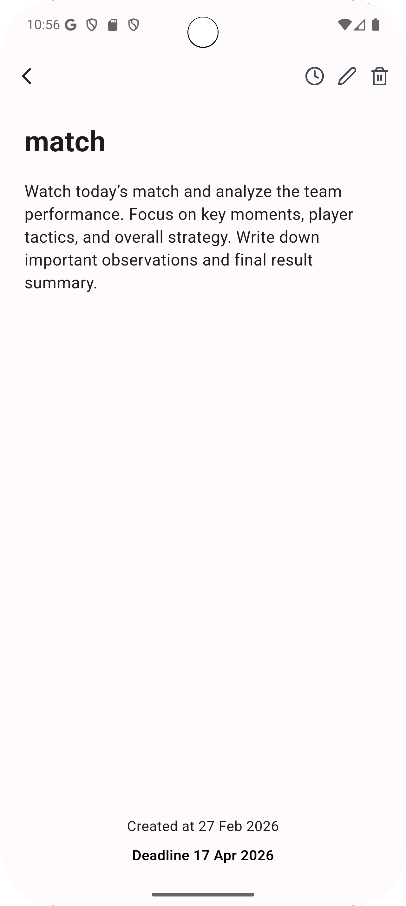
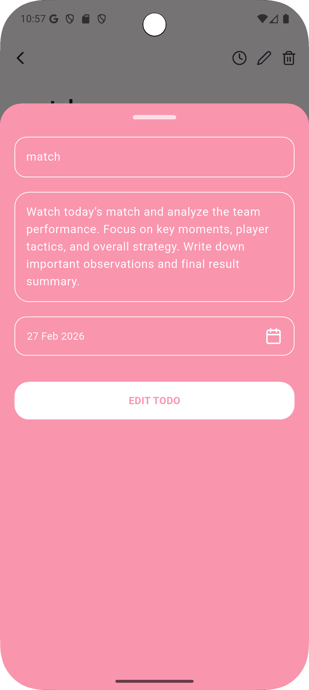
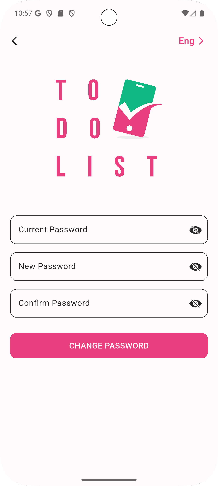
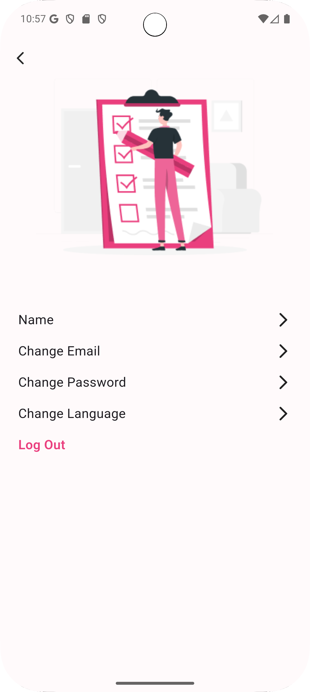

# ✅ ToDo App – Clean Architecture Flutter Application

<p align="center">
  
</p>

## 📌 Overview

**ToDo App** is a scalable Flutter application built using **Feature-Based Clean Architecture** and powered by **Firebase Authentication & Cloud Firestore**.

The app allows users to authenticate securely, manage tasks with full CRUD operations, and experience real-time updates — all structured with production-ready architecture principles.

---

## 🏗️ Architecture

This project follows a **Feature-Based Clean Architecture** approach to ensure:

- Scalability
- Maintainability
- Testability
- Clear separation of concerns

---

## 📂 Project Structure

```bash
lib/
│
├── core/
│   ├── di/
│   ├── routing/
│   └── utils/
│
├── data/
│   ├── auth/
│   │   ├── data_source/
│   │   ├── model/
│   │   └── repositories/
│   │
│   └── home/
│       ├── data_source/
│       ├── model/
│       └── repositories/
│
├── domain/
│   ├── auth/
│   │   ├── entities/
│   │   ├── repositories/
│   │   └── use_cases/
│   │
│   └── home/
│       └── repositories/
│
├── presentation/
│   ├── auth/
│   │   ├── cubit/
│   │   └── screens/
│   │
│   ├── home/
│   │   ├── cubit/
│   │   ├── screens/
│   │   └── widgets/
│   │
│   ├── profile/
│   │   └── screens/
│   │
│   ├── todo_details/
│   │   ├── screens/
│   │   └── widgets/
│   │
│   └── widgets/
│
└── main.dart
```

---

## 🧠 Clean Architecture Layers

| Layer | Responsibility |
|-------|---------------|
| **Presentation** | UI & State Management (Cubit) |
| **Domain** | Business Logic (Entities, UseCases, Contracts) |
| **Data** | Firebase Integration & Repository Implementations |
| **Core** | Dependency Injection, Routing, Utilities |

---

## ⚙️ Tech Stack

- ✅ Flutter
- ✅ Clean Architecture
- ✅ Cubit (flutter_bloc)
- ✅ Firebase Authentication
- ✅ Cloud Firestore (Real-time)
- ✅ GetIt (Dependency Injection)
- ✅ AutoRoute (Navigation)
- ✅ Form Validation
- ✅ Proper Error Handling

---

## ✨ Features

### 🔐 Authentication
- Email & Password Login
- Google Sign-In
- Secure Firebase Authentication
- Logout functionality

### 📝 Task Management
- Add new tasks
- Edit tasks
- Delete tasks
- View task details
- Real-time updates using Firestore streams

### 👤 Profile
- View user information
- Change password
- Logout

### 🛡️ Production-Level Practices
- Form validation
- Error handling states
- Loading states
- Clean separation between layers
- Dependency Injection
- Scalable folder structure

---

## 🖼️ Screenshots

All screenshots are located in `assets/shots/`

### 🔐 Sign In


### 📝 Sign Up


### 🏠 Home


### 📄 Task Details


### ✏️ Edit Task


### 🔑 Change Password


### 👤 Profile


---

## 🚀 Getting Started

### 1️⃣ Clone the repository

```bash
git clone https://github.com/abdalrhmanghanima/to_do_app.git
cd to_do_app
```

### 2️⃣ Install dependencies

```bash
flutter pub get
```

### 3️⃣ Setup Firebase

- Create a Firebase project
- Enable:
    - Authentication (Email/Password + Google)
    - Cloud Firestore
- Download `google-services.json` & `GoogleService-Info.plist`
- Run:

```bash
flutterfire configure
```

### 4️⃣ Run the project

```bash
flutter run
```

---

## 📈 Technical Highlights

- Modular Feature-Based Structure
- Strong Clean Architecture Implementation
- Firebase Real-time Data Handling
- AutoRoute Navigation Setup
- Proper State Management with Cubit
- Maintainable & Scalable Codebase
- Ready for future feature expansion

---

## 🔮 Future Improvements

- Unit & Widget Testing
- Task Categories / Filtering
- Push Notifications

---

## 👨‍💻 Author

**Abdo Ghanima**  
Flutter Developer  